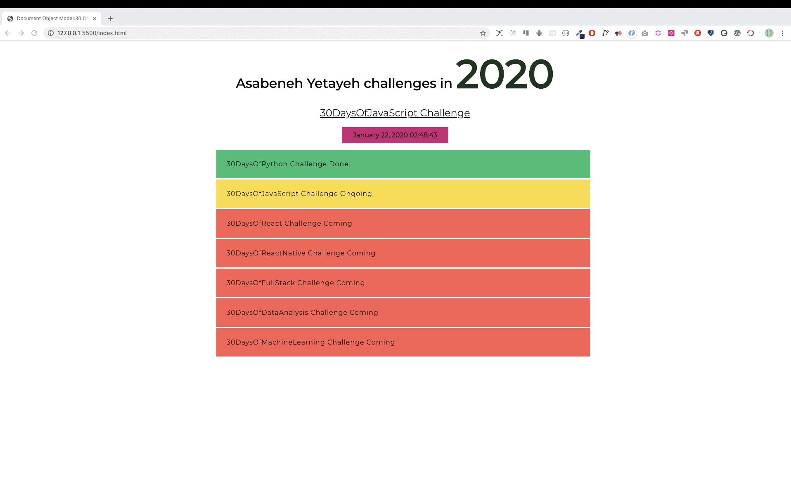
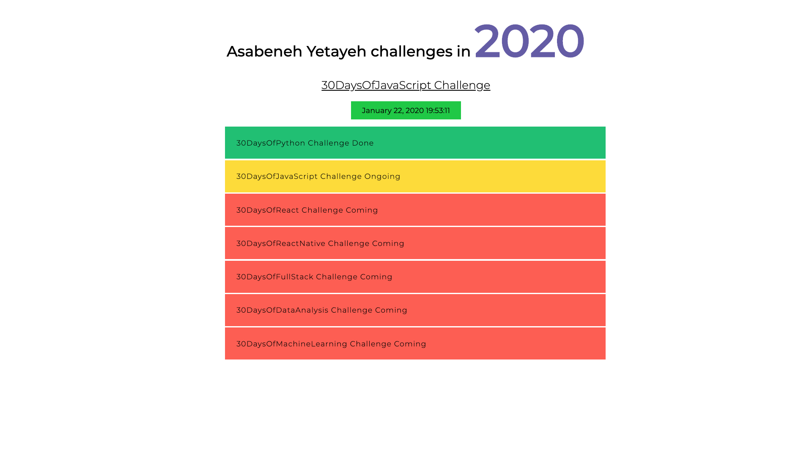

<div align="center">
  <h1> Day 21: DOM.</h1>
  <a class="header-badge" target="_blank" href="https://www.linkedin.com/in/manthan-ankolekar-597b07a8/">
  
  </a>
  <a class="header-badge" target="_blank" href="https://twitter.com/manthan_ank">
  
  </a>
</div>

## Level : 1

1. Create an index.html file and put four p elements as above: Get the first paragraph by using document.querySelector(tagname) and tag name

    ```html
    <!DOCTYPE html>
    <html>
    <head>
        <title>Paragraph Example</title>
    </head>
    <body>
        <p>First Paragraph</p>
        <p>Second Paragraph</p>
        <p>Third Paragraph</p>
        <p>Fourth Paragraph</p>

        <script>
            const firstParagraph = document.querySelector('p');
            console.log(firstParagraph);
        </script>
    </body>
    </html>
    ```

2. Get each of the the paragraph using document.querySelector('#id') and by their id

    ```html
    <!DOCTYPE html>
    <html>
    <head>
        <title>Paragraph Example</title>
    </head>
    <body>
        <p id="p1">First Paragraph</p>
        <p id="p2">Second Paragraph</p>
        <p id="p3">Third Paragraph</p>
        <p id="p4">Fourth Paragraph</p>

        <script>
            const paragraph1 = document.querySelector('#p1');
            const paragraph2 = document.querySelector('#p2');
            const paragraph3 = document.querySelector('#p3');
            const paragraph4 = document.querySelector('#p4');

            console.log(paragraph1);
            console.log(paragraph2);
            console.log(paragraph3);
            console.log(paragraph4);
        </script>
    </body>
    </html>
    ```

3. Get all the p as nodeList using document.querySelectorAll(tagname) and by their tag name

    ```html
    <!DOCTYPE html>
    <html>
    <head>
        <title>Paragraph Example</title>
    </head>
    <body>
        <p>First Paragraph</p>
        <p>Second Paragraph</p>
        <p>Third Paragraph</p>
        <p>Fourth Paragraph</p>

        <script>
            const paragraphs = document.querySelectorAll('p');
            console.log(paragraphs);
        </script>
    </body>
    </html>
    ```

4. Loop through the nodeList and get the text content of each paragraph

    ```html
    <!DOCTYPE html>
    <html>
    <head>
        <title>Paragraph Example</title>
    </head>
    <body>
        <p>First Paragraph</p>
        <p>Second Paragraph</p>
        <p>Third Paragraph</p>
        <p>Fourth Paragraph</p>

        <script>
            const paragraphs = document.querySelectorAll('p');
            paragraphs.forEach((paragraph) => {
                console.log(paragraph.textContent);
            });
        </script>
    </body>
    </html>
    ```

5. Set a text content to paragraph the fourth paragraph,Fourth Paragraph

    ```html
    <!DOCTYPE html>
    <html>
    <head>
        <title>Paragraph Example</title>
    </head>
    <body>
        <p>First Paragraph</p>
        <p>Second Paragraph</p>
        <p>Third Paragraph</p>
        <p id="p4">Fourth Paragraph</p>

        <script>
            const paragraph4 = document.querySelector('#p4');
            paragraph4.textContent = "Fourth Paragraph";
        </script>
    </body>
    </html>
    ```

6. Set id and class attribute for all the paragraphs using different attribute setting methods

    ```html
    <!DOCTYPE html>
    <html>
    <head>
        <title>Paragraph Example</title>
    </head>
    <body>
        <p id="p1">First Paragraph</p>
        <p class="para">Second Paragraph</p>
        <p>Third Paragraph</p>
        <p>Fourth Paragraph</p>

        <script>
            const paragraph1 = document.querySelector('#p1');
            const paragraph2 = document.querySelector('.para');
            const paragraphs = document.querySelectorAll('p');

            paragraph1.id = "newId";
            paragraph2.classList.add("newClass");

            paragraphs.forEach((paragraph, index) => {
                paragraph.id = `p${index + 1}`;
                paragraph.classList.add(`class${index + 1}`);
            });
        </script>
    </body>
    </html>
    ```

## Level : 2

1. Change stye of each paragraph using JavaScript(eg. color, background, border, font-size, font-family)

    ```html
    <!DOCTYPE html>
    <html>
    <head>
        <title>Paragraph Example</title>
    </head>
    <body>
        <p id="p1">First Paragraph</p>
        <p id="p2">Second Paragraph</p>
        <p id="p3">Third Paragraph</p>
        <p id="p4">Fourth Paragraph</p>

        <script>
            const paragraph1 = document.querySelector('#p1');
            const paragraph2 = document.querySelector('#p2');
            const paragraph3 = document.querySelector('#p3');
            const paragraph4 = document.querySelector('#p4');

            paragraph1.style.color = "blue";
            paragraph2.style.background = "yellow";
            paragraph3.style.border = "1px solid red";
            paragraph4.style.fontSize = "20px";
            paragraph4.style.fontFamily = "Arial";
        </script>
    </body>
    </html>
    ```

2. Select all paragraphs and loop through each elements and give the first and third paragraph a color of green, and the second and the fourth paragraph a red color

    ```html
    <!DOCTYPE html>
    <html>
    <head>
        <title>Paragraph Example</title>
    </head>
    <body>
        <p id="p1">First Paragraph</p>
        <p id="p2">Second Paragraph</p>
        <p id="p3">Third Paragraph</p>
        <p id="p4">Fourth Paragraph</p>

        <script>
            const paragraphs = document.querySelectorAll('p');
            paragraphs.forEach((paragraph, index) => {
                if (index === 0 || index === 2) {
                    paragraph.style.color = "green";
                } else {
                    paragraph.style.color = "red";
                }
            });
        </script>
    </body>
    </html>
    ```

3. Set text content, id and class to each paragraph

    ```html
    <!DOCTYPE html>
    <html>
    <head>
        <title>Paragraph Example</title>
    </head>
    <body>
        <p>First Paragraph</p>
        <p>Second Paragraph</p>
        <p>Third Paragraph</p>
        <p>Fourth Paragraph</p>

        <script>
            const paragraphs = document.querySelectorAll('p');
            paragraphs.forEach((paragraph, index) => {
                paragraph.textContent = `Paragraph ${index + 1}`;
                paragraph.id = `p${index + 1}`;
                paragraph.classList.add(`class${index + 1}`);
            });
        </script>
    </body>
    </html>
    ```

## Level : 3

DOM: Mini project 1

1. Develop the following application, use the following HTML elements to get started with. You will get the same code on starter folder. Apply all the styles and functionality using JavaScript only.

    1. The year color is changing every 1 second
    2. The date and time background color is changing every on seconds
    3. Completed challenge has background green
    4. Ongoing challenge has background yellow
    5. Coming challenges have background red

    ```html
    <!-- index.html -->
    <!DOCTYPE html>
    <html lang="en">
      <head>
        <title>JavaScript for Everyone:DOM</title>
      </head>
      <body>
        <div class="wrapper">
            <h1>Asabeneh Yetayeh challenges in 2020</h1>
            <h2>30DaysOfJavaScript Challenge</h2>
            <ul>
                <li>30DaysOfPython Challenge Done</li>
                <li>30DaysOfJavaScript Challenge Ongoing</li>
                <li>30DaysOfReact Challenge Coming</li>
                <li>30DaysOfFullStack Challenge Coming</li>
                <li>30DaysOfDataAnalysis Challenge Coming</li>
                <li>30DaysOfReactNative Challenge Coming</li>
                <li>30DaysOfMachineLearning Challenge Coming</li>
            </ul>
        </div>
      </body>
    </html>
    ```

    

    

    ```html
    <!-- index.html -->
    <!DOCTYPE html>
    <html lang="en">
    <head>
        <title>JavaScript for Everyone:DOM</title>
        <style>
            body {
                font-family: Arial, sans-serif;
            }

            .wrapper {
                max-width: 800px;
                margin: 0 auto;
                padding: 20px;
            }

            h1 {
                color: blue;
                text-align: center;
            }

            h2 {
                color: orange;
                text-align: center;
            }

            ul {
                list-style-type: none;
                padding: 0;
                margin: 0;
            }

            li {
                margin-bottom: 10px;
                padding: 10px;
            }
        </style>
    </head>
    <body>
        <div class="wrapper">
            <h1>Asabeneh Yetayeh challenges in 2020</h1>
            <h2>30DaysOfJavaScript Challenge</h2>
            <ul>
                <li id="python">30DaysOfPython Challenge Done</li>
                <li id="javascript">30DaysOfJavaScript Challenge Ongoing</li>
                <li id="react">30DaysOfReact Challenge Coming</li>
                <li id="fullstack">30DaysOfFullStack Challenge Coming</li>
                <li id="dataanalysis">30DaysOfDataAnalysis Challenge Coming</li>
                <li id="reactnative">30DaysOfReactNative Challenge Coming</li>
                <li id="machinelearning">30DaysOfMachineLearning Challenge Coming</li>
            </ul>
        </div>

        <script>
            // Function to change the year color every 1 second
            setInterval(changeYearColor, 1000);
            function changeYearColor() {
                const year = document.querySelector('h1');
                const randomColor = getRandomColor();
                year.style.color = randomColor;
            }

            // Function to change the date and time background color every 1 second
            setInterval(changeDateTimeBackground, 1000);
            function changeDateTimeBackground() {
                const dateTime = document.querySelector('h2');
                const randomColor = getRandomColor();
                dateTime.style.backgroundColor = randomColor;
            }

            // Function to get a random color in hexadecimal format
            function getRandomColor() {
                const letters = '0123456789ABCDEF';
                let color = '#';
                for (let i = 0; i < 6; i++) {
                    color += letters[Math.floor(Math.random() * 16)];
                }
                return color;
            }

            // Set background colors for completed, ongoing, and coming challenges
            const pythonChallenge = document.querySelector('#python');
            pythonChallenge.style.backgroundColor = 'green';

            const javascriptChallenge = document.querySelector('#javascript');
            javascriptChallenge.style.backgroundColor = 'yellow';

            const reactChallenge = document.querySelector('#react');
            reactChallenge.style.backgroundColor = 'red';

            const fullstackChallenge = document.querySelector('#fullstack');
            fullstackChallenge.style.backgroundColor = 'red';

            const dataAnalysisChallenge = document.querySelector('#dataanalysis');
            dataAnalysisChallenge.style.backgroundColor = 'red';

            const reactNativeChallenge = document.querySelector('#reactnative');
            reactNativeChallenge.style.backgroundColor = 'red';

            const machineLearningChallenge = document.querySelector('#machinelearning');
            machineLearningChallenge.style.backgroundColor = 'red';
        </script>
    </body>
    </html>
    ```

🎉 ✅Completed 🎉

[<< Day 20](/Day20/index.md) | [Day 22 >>](/Day22/index.md)
